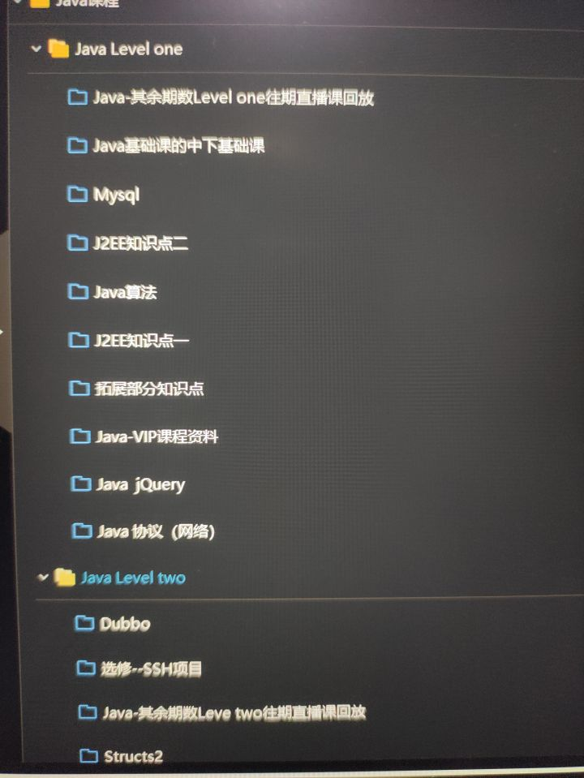
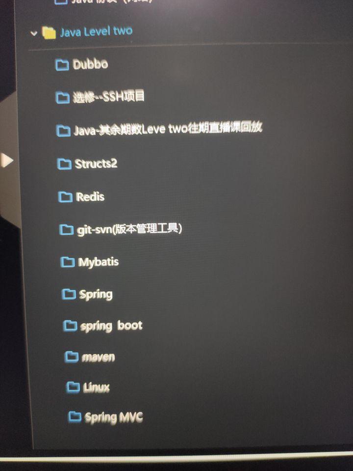
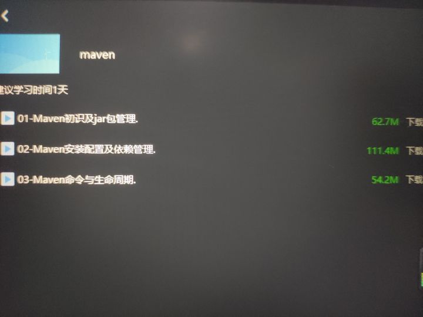
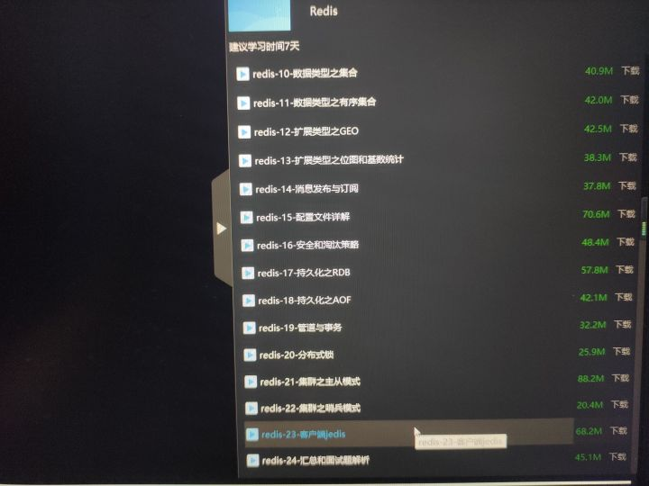
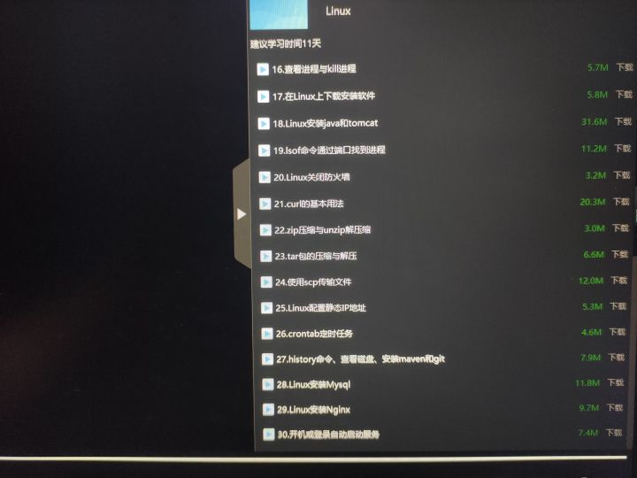

**为了受骗的同学(认识的好几个家境不是很好的，借钱，贷款的买课的同学，想突破还是需要谨慎！)发布一下，骗骗社畜就算了，收了学生的钱，不做事真好意思！**

先说下我的情况，本人后端混子，渣本毕业，工作2年+，薪资15k+，想进大厂(进个屁，笑)，现就职某小厂。

最近朋友叫我看看B乎的回答，我感觉我有资格回答一波(当初一肚子气，现在来答一波)。我买的Java全阶，看了下回答，居然有人还说好(这也正常，开课之后的一段时间，带班老师会让你们去腾讯课堂好评，朋友说好像之前的课下架了，说是都去腾讯课堂差评了，不知道他是哪期的了，好久之前的事情了)，厉害了我的哥。先说下结论，认识好几个进大厂的同学，有前端的有后端的，前端的同学我是看见他在摸鱼群里讨论渡一教育还有成哥的，然后我就加他了，说自己是几期的，那个同学是很早期前端全阶的了，好像是 2-5 期的(好久之前的事了)，就说被骗了，质量差的不行，然后他在群里也发了成哥在视频里说的关于成哥自己的事情，几个大厂的大佬说了些什么，我就不说了。
后端的没啥好说的，认识的同学抱怨挺大的，当初报班时说好，会帮他们赶春招还是秋招，然后课程更了一年，还是那样，当初答应出的课没出，然后一直开了训练营(小白真好骗，过几年30岁了我也要当老师/狗头)。熊猫老师离职(最近感觉老师走了好多)，渡一说是去北京进阶学习(好家伙进阶还要退群)，多久过去了也没回来。大厂的同学(已上薪资榜)，在没有出薪资榜还是什么榜的时候，就跟我说了质量不行，想进步就看一些书和博客吧。

好不好，直接看课程目录好吧，就先不说质量了，后端全阶PPT画的天花乱坠，我发个课程目录影响问题不大吧，都是 ppt 路线里的东西，没什么问题吧，没什么问题吧？

======================== 

先看看蚂蚁金服p7还是p8老师讲的课。
先看看git和maven，你自己看看视频文件大小，你就知道课程有多短了。别给我说开发够用，别给我说开发中都用可视化，然后点一点就好了，git 和 maven 有多少东西，就不用我说了吧，这些内容，说白了，就像背稿子一样。芜湖，想起来了，认识的同学说，**老师为了赶课程，背的面试题吧**，说某块知识点有问题，很多面试题都是这样写的，他调试过了，说底层根本不是这样。

Redis的话，基础使用没啥好讲的，文档里都有，讲一下也应该。看看后面进阶的内容的课程大小吧，主从模式、哨兵模式、缓存和雪崩，看着文件大小，你就知道说了些什么吧？
没错，都是照着 ppt 给你讲概念，你说你花这些冤枉钱干嘛，给我一瓶肥宅快乐水，我念给你听？ p7还是p8的能力，代码复盘能力体现的淋漓尽致，我学会了，学会了！？

linux跟你讲命令用法，看视频文件大小，你有这心思，看看书不好吗，书可不要几千块，而且还细致。

你想，那实战课应该还可以吧？抱歉，我没看(第一阶课看了部分，我就知道我上当了，何必浪费时间？居然还有学生去借钱买课，我还是想说，成哥营销学学的真棒)，好几期的小伙伴说质量差的不行，老师课上改 bug，然后讲不完就加课，还有的说还不如牛客网上的课程来的详细。

**总结：Java 全阶无高并发处理，无秒杀项目模拟，无超强数据结构优化项目，干货甚少，并不是你想要的进阶课，你买的课程只是单纯的CRUD，只能够写比较好毕设(比较好一点的软件工程，你可能还是排不上号，我老大985可比这更牛逼多了)。**

============================

**想学习Java基础，就看公开课吧，小白可能看不懂书，可以看看(免费的)视频，有能力的就看书，经典书籍，B乎一搜就有(你学个屁语法要花1w块？)，前端没买，估计也一个尿性，购买需谨慎，再也不会入网课的坑了，买了你绝对会后悔。**

**那么多国家专利的老师，也不至于来给机构上课，长点心，长点心，下单需谨慎，既然谈到数据结构了，那就再上一波图，这么短的视频，你想他会带你写的多深入？芜湖，数据结构可没有实战课，都是概念**

最后，我还是想笑，**成哥答应你们的事，一个都没做到**，这些课程质量也是市场常规价格(老师们真会昧着良心说话，你有这些钱，你买一些书看不好吗？？韭菜？)，资本到最后都是圈钱。还有看了渡一助教的朋友圈说月薪30k的大佬，跟面试官吹教育机构，还是头一次见。我认识的大佬，30k可不会这么搞笑，**刚入门的小白或者寻求进步的大佬们长点心，现在不仅要担心领导给你画饼，也还要担心机构给你画饼！**。**想进步，多白嫖，B站大法好**。
